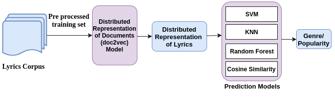

# Its-only-words-and-words-are-all-I-have

## Description:
This project uses distributed representation of documents approach to perform music mining tasks. As part of music mining task we are working on two tasks: prediction of genre and prediction of popularity of English songs based on lyrics (NLP). Using distributed representation models we gets embedding for each songs as well as embedding of each genre and popularity class.
We use cosine-similarity between songs embedding as well as genre embedding to predict its genre. We also experimented with classical models like SVM, RandomForest, KNN using the generated songs embeddings.  

## Requirements:
1. Python 3.6
2. gensim 2.2.0
3. numpy 1.12.1
4. panda 0.20.1
5. scipy 0.19.0
6. scikit-learn 0.18.1

## Architecture:
Our architecture diagram is as below. We experimented with both distributed memory and distributed bag of words approach of distributed representation generation of documents to get embeddings for each songs.

  

## Dataset:
Lyrics of songs are collected from user generated contents from internet as there is no publicly available datset for songs, due to copyright issues. We are not sharing our dataset due to same reason. For verification purpose user generated songs can be used to test the pre trained model.

## Execution Steps:
Genre prediction codes are available in genre predition directory, whereas Popularity prediction codes are available in popularity prediction directory.
### Genre Prediction:
  1. Copy the dataset in sub directory dataset.
  2. create_80_20_split.py <did> file in dataset directory creates a balanced set of sampled data for each experiment taking      an input to identify each experiment.
  3. train_doc2vec.py <model> <did> trains the model, it takes two parameter to select the model to be used and the                experiment dataset identification ID to select dataset. Trained models are stored in models directory.
  4. test.py <did> takes one parameter experiment dataset identification ID and perform cosine similarity between test songs      embeddings and genre embeddings to predict its genre. It stores the confusion matrix in confusion_matrix directory.
  5. f1_score.py <did> calculates the f1 score from confusion matrix.

### Popularity Prediction:
  All the execution steps for popularity prediction files are similar to genre prediction task with each file needs an extra   parameter genre name. As all popularity prediction tasks are done by creating a separate model for each genre.
 
 Models directory contains some pre trained models. Results are stored in results directory.
